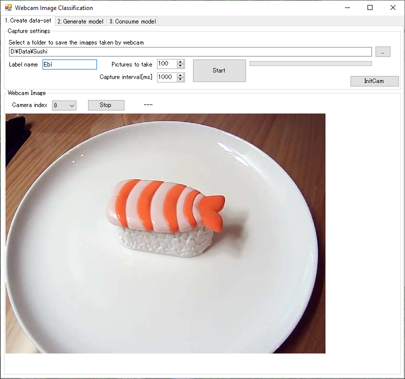
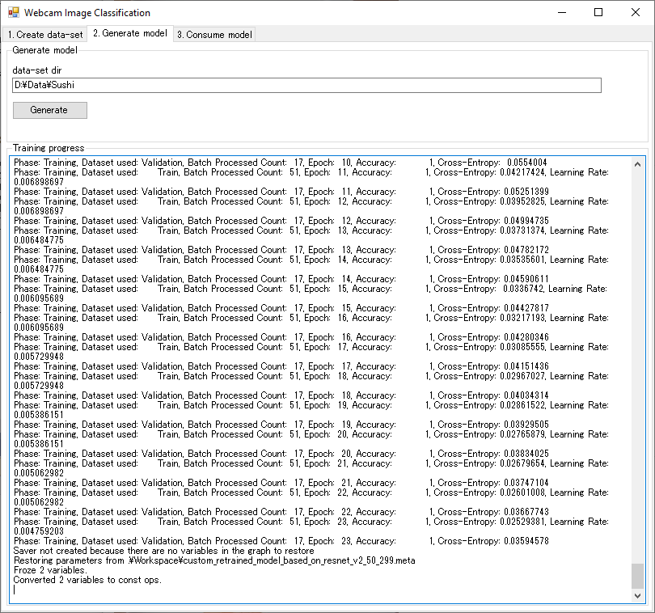
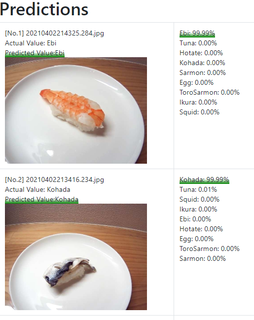
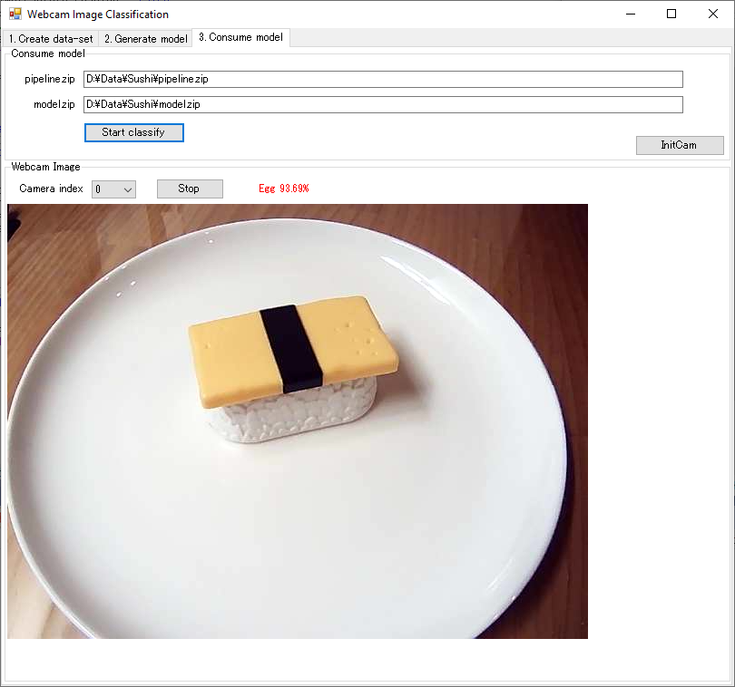

# WebcamImageClassification
A WinForms example of ML.NET image classification through webcam.
You can experience preparing training data, generating models, and classifying images in real time with a webcam.

# Requirements
* Windows 10
* VisualStudio 2019
* .NET Core3.1
* A webcam(usbcam)

# Usage
## Step1. Gathering data
1. Select [1.Create data-set] tab.
1. Select a folder to save images as a data-set.
1. Enter a label in the "Label name" textbox for the image to be captured.
1. Specify the number of images to be taken and the interval between shots. 
1. Press [Start] button to start capturing images for training using the Web camera.
1. Repeat 3 to 5 for the number of labels you want to classify.

## Step2. Generate model
1. Select [2.Generate model] tab.
1. Make sure that the data-set folder you selected in Step1 is displayed in the text box. 
1. Press [Genarate] button.
After the training is finished, pipeline.zip and model.zip will be created in the data-set folder.

Also, the result will be displayed as an HTML file as shown below.

## Step3. Consume model
1. Select [3.Consume model] tab.
1. Make sure that the paths to pipeline.zip and model.zip are filled in the text boxes respectively.
1. Press [InitCam] button to initialize the webcam.
1. Press [Start classify] button. You will see which label the object was classified and its score every 3-sec. 

A model trained on a real egg-sushi was able to recognize a toy one.:smile:
